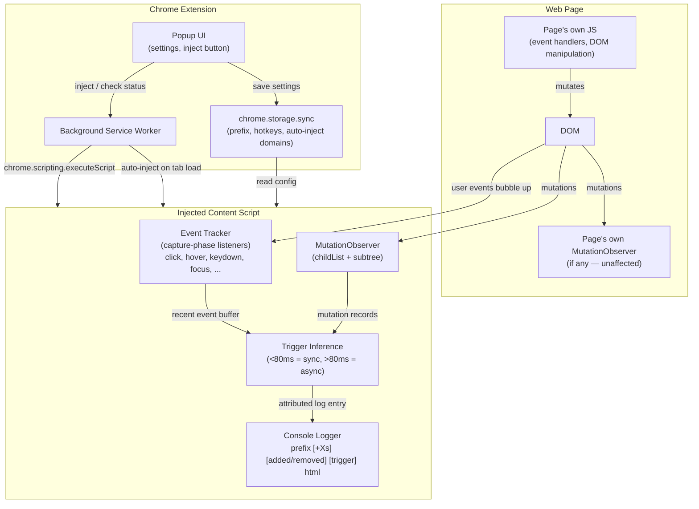
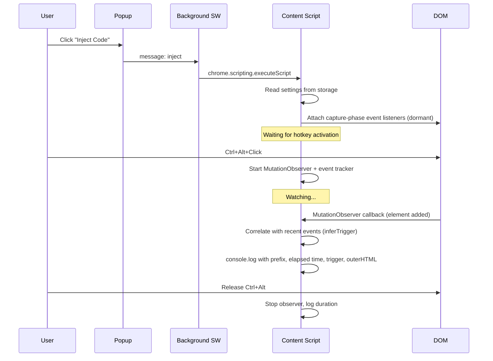

# DOM Hints

A Chrome extension that observes DOM mutations on any web page and logs them to the console with trigger attribution — without modifying or interfering with the page's own code.

## How it works

The extension injects a content script that uses a `MutationObserver` to watch for element insertions and deletions. To infer what caused each mutation, it listens to user interaction events (click, hover, keydown, etc.) via capture-phase listeners on `document` and correlates their timing and targets with observed mutations.

- **Synchronous mutations** (within 80ms of a user event) are attributed to that event (e.g., `click on button#add-btn`)
- **Async mutations** (e.g., from `setTimeout`) are labeled `async` with the time elapsed since the last user interaction
- **Unknown mutations** with no prior interaction context are labeled `unknown`



### Activation flow



## Installation

1. Clone this repo
2. Open `chrome://extensions` in Chrome
3. Enable **Developer mode**
4. Click **Load unpacked** and select the `extension/` folder

## Usage

- Click the extension icon to open the popup
- Click **Inject Code** to inject the observer into the current tab
- Use the dropdown (▾) to auto-inject on the current domain for 1 hour or always
- **Ctrl+Alt+Click** on the page to start watching mutations
- Release **Ctrl** and **Alt** to stop — the console logs the session duration

### Settings

| Setting | Default | Description |
|---|---|---|
| Log prefix | `dom-hint:` | Label prepended to every console log entry |
| Activation modifiers | Ctrl + Alt | Modifier keys required (+ click) to toggle the observer |
| Auto-inject domains | *(none)* | Managed from the popup dropdown or the options page |

## Test page

Open `index.html` to test with a page that has its own `page-observer:` MutationObserver, tooltips, list manipulation buttons, and a delayed mutation timer. Both observers log independently to the console.

## Project structure

```
extension/
├── manifest.json     # Manifest V3
├── background.js     # Service worker: auto-inject, message handling
├── content.js        # Injected observer with trigger inference
├── popup.html/js/css # Extension popup
└── options.html/js/css # Auto-inject domain management
index.html            # Test page with competing observer
```
